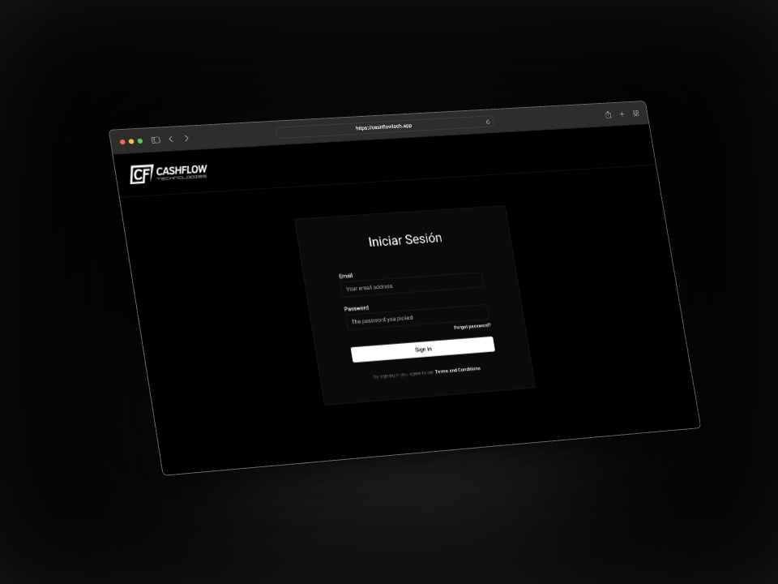
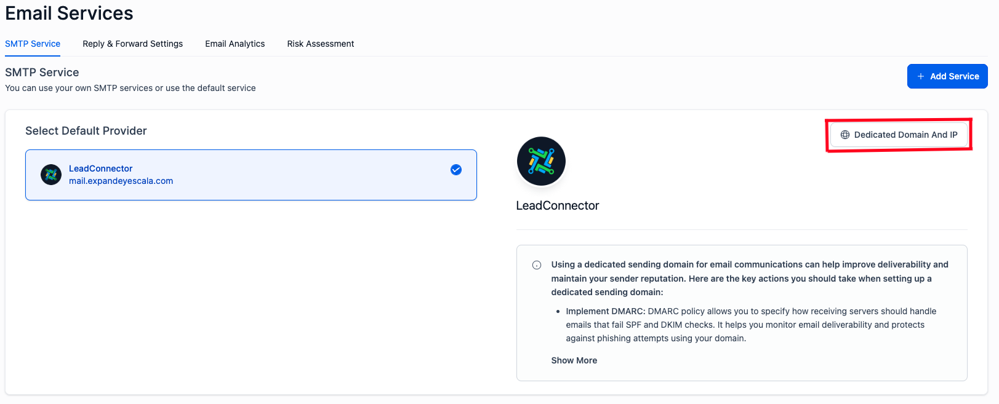
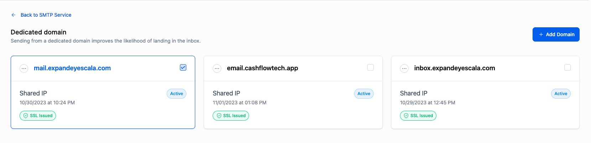

# Actualizaciones

Descubramos las **nuevas actualizaciones**.

## Dominio personalizado

**URL:** https://cashflowtech.app.


## Personalización del software con branding CashFlow

Codigo CSS personalizado:

```css
/*START*/
/*Color para el fondo header del login page + borde*/
.hl_login--header {
  background: #000!important;
  border-bottom: 1px solid rgb(255, 255, 255, 0.1)!important;
}

/*Cambiando color de fondo de toda la aplicacion*/
#app {
    background:rgb(0, 0, 0, 0.02)!important;
}

/*Color negro para el fondo del login*/
.hl_login {
    background: #000!important;
    height:100vh!important;
}

/*Color en los bordes y fondo para el formulario del login*/
.hl_login--body .card {
  background: rgb(10, 10, 10, 1)!important;
  border: 1px solid rgb(255, 255, 255, 0.1)!important;
}

/*Color blanco Titulo del login*/
.hl_login--body .heading2{
  color:#FFF!important;
}

/*Color blanco para labels del login form*/
.hl-text-input-label.block.text-sm.font-medium.text-gray-700.mb-1 {
   color:#FFF!important;
}

/*Cambiando texto de login page*/
.hl_login--body .heading2 {
visibility: hidden!important;
position: relative!important;
}
.hl_login--body .heading2::after {
content: "Iniciar Sesión"!important;
color: white!important!important;
position: absolute!important;
width: 100%!important;
left: 0!important;
visibility: visible!important;
}

/*Cambiando color de "Forgot password?"*/
#forgot_passowrd_btn {
    color: rgb(221, 221, 221)!important;
}

/*Cambiando color de Terms and conditions*/
.text-curious-blue-500.hover\:text-curious-blue-800.font-semibold {
    color: rgb(221, 221, 221)!important;
}

/*Cambiando el color de los inputs login page*/
#email {
    background-color: transparent!important;
    border: 1px solid rgb(255, 255, 255, 0.1)!important;
    color:#FFF!important;
}
#password {
    background: transparent!important;
    border: 1px solid rgb(255, 255, 255, 0.1)!important;
    color:#FFF!important;
}

/*Cambiando color del botón login page*/
.hl-btn.justify-center.w-full.inline-flex.items-center.px-4.py-2.border.border-transparent.text-sm.font-medium.rounded.text-white.bg-curious-blue-500.hover\:bg-curious-blue-600.focus\:outline-none.focus\:ring-2.focus\:ring-offset-2.focus\:ring-curious-blue-600 {
    background: white!important;
    color:#000!important;
}

/*Cambiando color de la barra superior dentro de la app*/
.sidebar-v2-location .hl_header {
    background: #000!important;
}
.flex.flex-row.justify-start.items-center.topmenu-nav {
    background: #FFF!important;
}

/*Cambiando color de sección seleccionada en sidebar*/
.sidebar-v2-location #sidebar-v2 .hl_nav-header nav a.active, .sidebar-v2-location #sidebar-v2 .hl_nav-header nav a:hover, .sidebar-v2-location #sidebar-v2 .hl_nav-settings nav a.active, .sidebar-v2-location #sidebar-v2 .hl_nav-settings nav a:hover {
    background: rgb(255, 255, 255, 0.2)!important;
    border: 1px solid rgb(255, 255, 255, 0.22)!important;
    width: auto!important;
}

/*Cambiando colores del account switcher*/
.sidebar-v2-location #sidebar-v2 #location-switcher-sidbar-v2 {
    background: rgb(255, 255, 255, 0.2)!important;
    border: 1px solid rgb(255, 255, 255, 0.22)!important;
}

/*Cambiando colores de la search bar*/
.sidebar-v2-location #sidebar-v2 #globalSearchOpener, .sidebar-v2-location #sidebar-v2 #quickActions {
    background: rgb(255, 255, 255, 0.2)!important;
    border: 1px solid rgb(255, 255, 255, 0.22)!important;
}

/*Agregando márgenes al los ítems del Sidebar*/
.flex-1.w-full {
    padding: 0 10px 0 10px!important;
}

/*Quitando color de fondo a la barra divisora del Sidebar*/
.sidebar-v2-location #sidebar-v2 .hl_nav-header nav a.active.divider, .sidebar-v2-location #sidebar-v2 .hl_nav-header nav a:hover.divider, .sidebar-v2-location #sidebar-v2 .hl_nav-settings nav a.active.divider, .sidebar-v2-location #sidebar-v2 .hl_nav-settings nav a:hover.divider {
    background: transparent!important;
    border: none!important;
}

/*Cambiando color de topbar*/
.flex.flex-row.justify-start.items-center.topmenu-nav {
    height:60px!important;
}

/*Quitando padding de top bars*/
.sidebar-v2-location .hl_header .topmenu-nav .topmenu-navitem {
    border: 1px solid rgb(0, 0, 0, 0.2)!important;
    border-radius: 10px!important;
    padding: 5px 10px!important; 
}

/*Quitando padding de separador top bar*/
.sidebar-v2-location .hl_header .topmenu-nav .topmenu-navitem.divider {
    padding: 0px!important;
    border-radius:0px!important;
    margin:0px!important;
}

/*Quitando padding y bordes a icono de engranaje*/
#tb_contact-custom-fields-settings {
    padding:0px 0px 0px 10px!important;
    border:none!important;    
}

/*Quitando padding de title top bar*/
.topmenu-navtitle {
    padding: 0px 10px!important;
}

/*Agregando padding a el top Tab de conversaciones sección*/
.-mb-px.flex.place-content-evenly.space-x-4 {
    margin-top: 22px!important;
}

.sidebar-v2-location .hl_header .topmenu-nav .topmenu-navitem.active {
    color: #FFF!important;
    background:rgb(0, 0, 0, 0.9)!important;
    border-color:#000!important;
}

/*Quitando margenes del iframe academia expansionismo*/
[data-v-258e3d29] {
    height: 100vh!important;
}

/*END*/

/* Overflow hidden */
.transition-slowest .flex-col > .overflow-hidden{
 background-color:#000000;
}

```

Este codigo pueden encontrarlo en la vista de agencia > settings > company

### Vista previa



## Personalización del favicon

Script:

```javascript
var faviconURL = 'https://storage.googleapis.com/msgsndr/AzDVLdB2vGcm9Lw8JNwH/media/6540750d1eae1812943fe074.png'

    var link = document.querySelector("link[rel*='icon']") || document.createElement('link');
    link.type = 'image/x-icon';
    link.rel = 'shortcut icon';
    link.href = faviconURL
    document.getElementsByTagName('head')[0].appendChild(link);
```

Este codigo pueden encontrarlo en la vista de agencia > settings > company


## Dominio dedicado para delivery de emails

Para evitar que los correos electrónicos lleguen a la bandeja de spam, es recomendable contar con un dominio dedicado. Es importante mantener un ritmo controlado de envío de correos para no afectar su reputación. Además, es fundamental agregar todos los registros de seguridad DKIM, DMARC y SPF.

Actualmente, están conectados tres dominios dedicados, de los cuales uno (inbox.expandeyescala.com) ya tiene una baja reputación. Les recomiendo que no utilicen los dominios sin calentarlos previamente, es decir, que aumenten gradualmente la entrega de correos electrónicos. De esta manera, podrán lograr que el dominio tenga una buena reputación y, en consecuencia, una alta capacidad de entrega.

**La Seccion de Emial serivices la encontratan en setting > email services**



